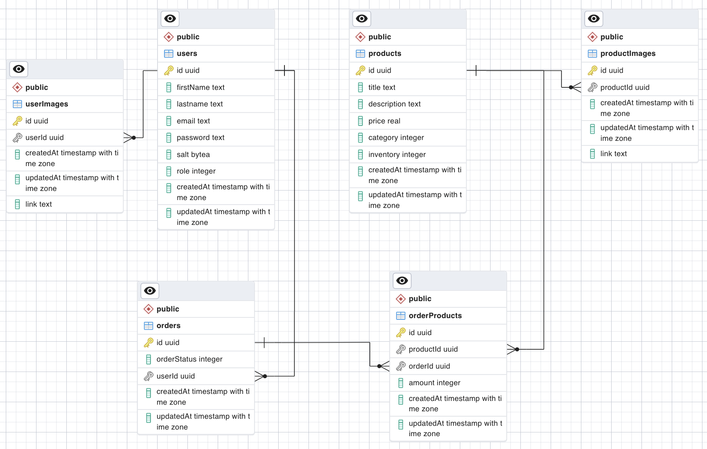
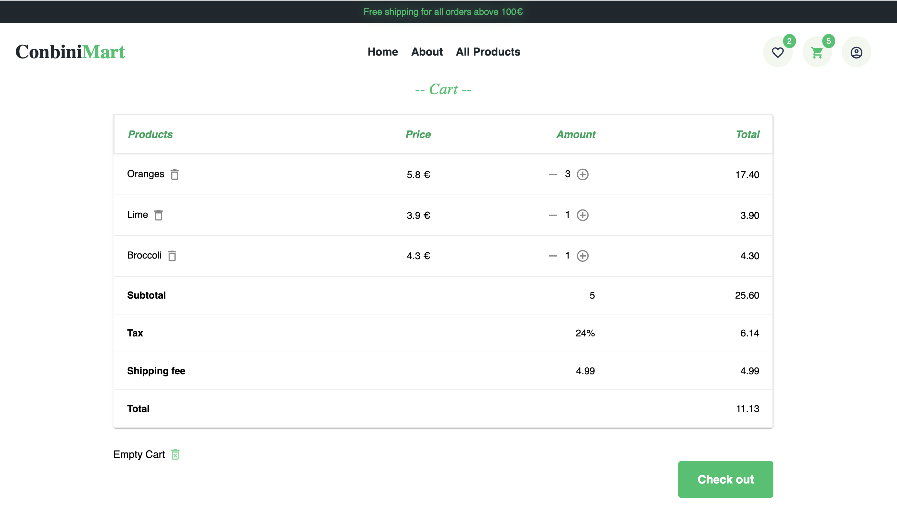

# 1. Fullstack Project


This project involves creating a Fullstack project with React and Redux on the frontend and ASP.NET Core 7 on the backend. The goal is to provide a seamless experience for users, along with robust management system for administrators.

- Frontend: SASS, TypeScript, React, Redux Toolkit
- Backend: ASP .NET Core, Entity Framework Core, PostgreSQL

You can follow the same topics as your backend project or choose the alternative one, between E-commerce and Library. You can reuse the previous frontend project, with necessary modification, or make a new layout to fit your backend server.

## Table of Contents
1. [Introduction](#fullstack-project)

2. [Features requirement](#features)
   - 2.1. [Mandatory features](#mandatory-features)
   - 2.2. [Extra features](#extra-features)
   - 2.3. [Requirements](#requirements)

3. [How to run project locally](#run-project-locally)

4. [Project Result](#project-result--backend)

   4.1 [Backend](#project-result--backend)
      - 4.1.1. [Project Design](#project-design)
      - 4.1.2. [Features](#features-1)
      - 4.1.3. [Backend Demo](#backend-demo)
      - 4.1.4. [Testing](#testing)

   4.2 [Frontend](#project-result--frontend)
      - 4.2.1. [Features](#features-2)
      - 4.2.2. [Frontend Demo](#frontend-demo)
      - 4.2.3. [How to test features](#423-how-to-test-features)


## 2. Features

### 2.1. Mandatory features

#### a. User Functionalities

1. User Management: Users should be able to register for an account and log in. Users cannot register themselves as admin.
2. Browse Products: Users should be able to view all available products and single product, search and sort products.
3. Add to Cart: Users should be able to add products to a shopping cart, and manage cart.
4. Checkout: Users should be able to place order.

#### b. Admin Functionalities

1. User Management: Admins should be able to view and delete users.
2. Product Management: Admins should be able to view, edit, delete and add new products.
3. Order Management: Admins should be able to view all orders

### 2.2. Extra features

#### a. User Functionalities

1. User Management: Users should be able to view and edit only certain properties in their accounts. They also can unregister their own accounts.
2. Authentication and account registration with Google Oauth.
3. Order Management: Users should be able to view their order history, track the status of their orders, and potentially cancel orders within a certain timeframe.

#### b. Admin Functionalities

1. User Management: Admins should be able to edit users' role and create new users.
2. Order Management: Admins should be able to update order status, view order details, handle returns/refunds, and cancel orders.

And any other extra features that you want to implement ...

## 2.3. Requirements

1. Apply CLEAN architecture in your backend. In README file, explain the architecture of your project as well.
2. Implement Error Handling Middleware: This will ensure any exceptions thrown in your application are handled appropriately and helpful error messages are returned.
3. Document with Swagger: Make sure to annotate your API endpoints and generate a Swagger UI for easier testing and documentation.
4. Project should have proper file structure, naming convention, and comply with Rest API.
5. `README` file should sufficiently describe the project, as well as the deployment.
6. Unit testing, and optionally integration testing, must be included for both frontend and backend code. Aim for high test coverage and ensure all major functionalities are covered.

# 3. Run project locally
- Backend:
   ```dotnet restore```
   ```cd Ecommerce.WebApi/```
   Set up ConnectionStrings in appsettings.json or appsettings.Development.json, example: 
   ```
   "ConnectionStrings": {
      "DefaultConnection": "Server=127.0.0.1; Host=localhost; Port=5432; Database=databaseId; User Id=yourUserId;"
      }
   ```
   then ```dotnet run```

- Frontend:
   ```npm start```
   or ```npm run compile:watch & npm start``` to compile SCSS first


# 4.1. Project Result : Backend

## 4.1.1. Project Design

Topic: E-commerce

#### Entities design



Brief:
   - User: has Role either Admin or User
   - Product: belongs to a Category type
   - Order: has Status, has 1-to-many relationship with OrderProduct
   - OrderProduct: has Order's id & Product's id as Foreign Keys, has 1-to-many relationship with Product
   --> User can make many Orders
   --> Each Order can have many OrderProducts

#### Endpoints design


Brief:
   - Most endpoints are protected, only the one without any mark are accessible to everyone
   - Authentication mark: means that User have to log in to acess these endpoints
   - Authorization: Only user with Admin Role can access to these endpoints

#### Authentication strategy

User log in with credentials --> Verify credentials --> if success, token is returned back to user --> use token to authenticate

#### Architecture : CLEAN 


## 4.1.2. Features

#### User Functionalities

- Users can register for an account, email for each user is unique, no email is used for 2 accounts. Users can not register as an Admin.
- Users can log in and access certain endpoints, e.g. get their profile, update password, update their profile (name, email), delete their own account, get all their orders, etc.

#### Product Functionalities
- Browse Products: anyone can browse available products and single product. Users can also search and sort products using query.
- Orders:
   - Logged in users can make new orders (with orders products).
   - A user can browse all orders created by them.

#### Admin Functionalities

- User Management: Admins can view all users, or view a sigle user. Admin can create new admin account.
- Product Management: only Admins can create, edit, and delete products.

## 4.1.3. Backend demo

- [Swagger Docs](https://fs15kim-ecommerce-backend.azurewebsites.net/swagger/index.html) 

- Backend base URL: https://fs15kim-ecommerce-backend.azurewebsites.net/api/v1
   - Example: 
      - Get all products: https://fs15kim-ecommerce-backend.azurewebsites.net/api/v1/products
      - Get all categories: https://fs15kim-ecommerce-backend.azurewebsites.net/api/v1/category

## 4.1.4. Testing
xUnit is used for testing

# 4.2. Project Result : Frontend

[Frontend demo in Netlify](https://conbinimart.netlify.app/)

Home page
<p>


</p>

Products page
<p>

</p>

Product's details page
<p>

</p>

About & Log in page
<p>


</p>


## 4.2.1. Features

#### Products
- Browse all products
- Browse products by category
- Search products by name
- Sort & set order for products display, set limit per page
- Add products to favorites, remove from favorites

Example of search products by name


#### Users
- Sign up as new user
- Log in if already registered,  log out

Validation examples when log in & sign up
<p>


</p>
<p>


</p>


- Modify profile
   - Edit information (first name, last name, email)
   - Change password
   - Delete account
<p>


</p>


- To users with Admin Role: 
   - Create new product
   - Delete a product
   - Update a product's information

Differences in profile page between User & Admin
<p>


</p>

Create & Delete a product
<p>


</p>

<p>
Product's details view with Admin Role, Update a product


</p>


#### Orders
- Add products to cart, remove from cart, modify products' quantity
- Checkout/Place order
- See all orders made by logged in user

Cart & all orders example
<p>


</p>


## 4.2.2. Frontend Demo
[Frontend demo in Netlify](https://conbinimart.netlify.app/)

## 4.2.3. How to test features
To see all registered users: https://fs15kim-ecommerce-backend.azurewebsites.net/api/v1/users


To test features as normal user without registering, you can log in using these 2 example accounts:
- email: john@mail.com
   password: john123
- email: testing@mail.com
   password: testing123

To test features as Admin, you can log in using:
email: admin@mail.com
password: admin123

