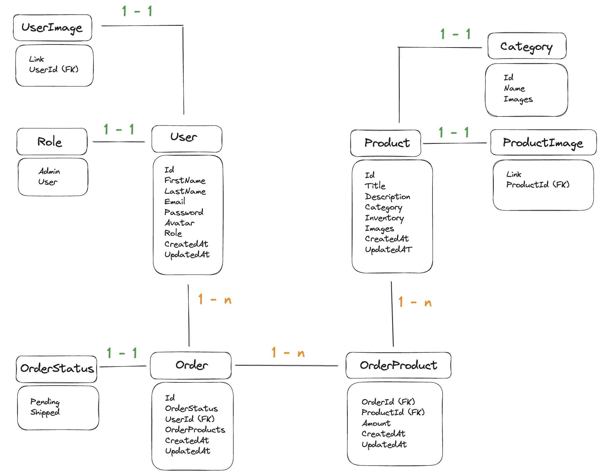
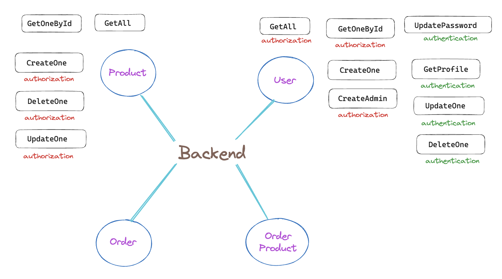

# Fullstack Project

This project involves creating a Fullstack project with React and Redux on the frontend and ASP.NET Core 7 on the backend. The goal is to provide a seamless experience for users, along with robust management system for administrators.

- Frontend: SASS, TypeScript, React, Redux Toolkit
- Backend: ASP .NET Core, Entity Framework Core, PostgreSQL

You can follow the same topics as your backend project or choose the alternative one, between E-commerce and Library. You can reuse the previous frontend project, with necessary modification, or make a new layout to fit your backend server.

## Table of Contents
Introduction: 

[Features](#features)
   - [Mandatory features](#mandatory-features)
   - [Extra features](#extra-features)
[Requirements](#requirements)
[Getting Started](#getting-started)
[Testing](#testing)

Project Result:

## Features

### Mandatory features

#### User Functionalities

1. User Management: Users should be able to register for an account and log in. Users cannot register themselves as admin.
2. Browse Products: Users should be able to view all available products and single product, search and sort products.
3. Add to Cart: Users should be able to add products to a shopping cart, and manage cart.
4. Checkout: Users should be able to place order.

#### Admin Functionalities

1. User Management: Admins should be able to view and delete users.
2. Product Management: Admins should be able to view, edit, delete and add new products.
3. Order Management: Admins should be able to view all orders

### Extra features

#### User Functionalities

1. User Management: Users should be able to view and edit only certain properties in their accounts. They also can unregister their own accounts.
2. Authentication and account registration with Google Oauth.
3. Order Management: Users should be able to view their order history, track the status of their orders, and potentially cancel orders within a certain timeframe.

#### Admin Functionalities

1. User Management: Admins should be able to edit users' role and create new users.
2. Order Management: Admins should be able to update order status, view order details, handle returns/refunds, and cancel orders.

And any other extra features that you want to implement ...

## Requirements

1. Apply CLEAN architecture in your backend. In README file, explain the architecture of your project as well.
2. Implement Error Handling Middleware: This will ensure any exceptions thrown in your application are handled appropriately and helpful error messages are returned.
3. Document with Swagger: Make sure to annotate your API endpoints and generate a Swagger UI for easier testing and documentation.
4. Project should have proper file structure, naming convention, and comply with Rest API.
5. `README` file should sufficiently describe the project, as well as the deployment.
6. Unit testing, and optionally integration testing, must be included for both frontend and backend code. Aim for high test coverage and ensure all major functionalities are covered.

# Project Result : Backend
!!!Current status: incomplete

## Project Design

#### Entities design

Brief:
   - User: has Role either Admin or User
   - Product: belongs to a Category type
   - Order: has Status, has 1-to-many relationship with OrderProduct
   - OrderProduct: has Order's id & Product's id as Foreign Keys, has 1-to-many relationship with Product
   --> User can make many Orders
   --> Each Order can have many OrderProducts

#### Endpoints design
!!!!Current status: incomplete, only endpoints for User & Product are working

Brief:
   - Most endpoints are protected, only the one without any mark are accessible to everyone
   - Authentication mark: means that User have to log in to acess these endpoints
   - Authorization: Only user with Admin Role can access to these endpoints

#### Authentication strategy

User log in with credentials --> Verify credentials --> if success, token is returned back to user --> use token to authenticate

#### Architecture : CLEAN 

## Features
!!! Only working features are listed here

#### User Functionalities

- Users can register for an account, email for each user is unique, no email is used for 2 accounts. Users can.not register as an Admin/
- Users can log in and access certain endpoints, e.g. get their profile, update password, update their profile (name, email), delete their own account.

#### Product Functionalities
- Browse Products: anyone can browse available products and single product. Users can also search and sort products.

#### Admin Functionalities

- User Management: Admins can view all users, or view a sigle user. Admin can create new admin account.
- Product Management: only Admins can create, edit, and delete products.

## Backend demo

- [Swagger Docs](https://kim-fs15-ecommerce-backend.azurewebsites.net/swagger/index.html) 

- Backend base URL: https://kim-fs15-ecommerce-backend.azurewebsites.net/

## Testing
xUnit is used for testing

# Project Result : Frontend
!!! Status: not implemented yet
